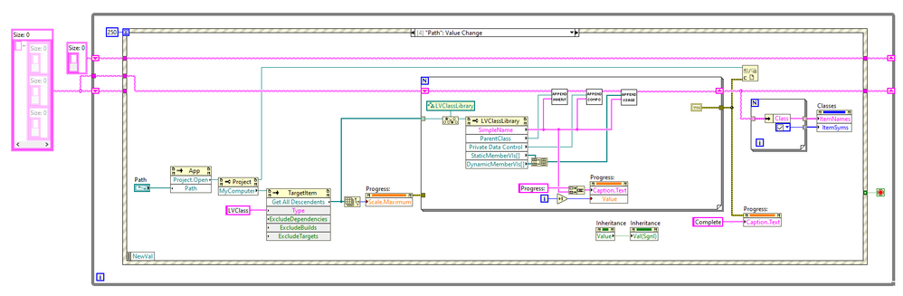
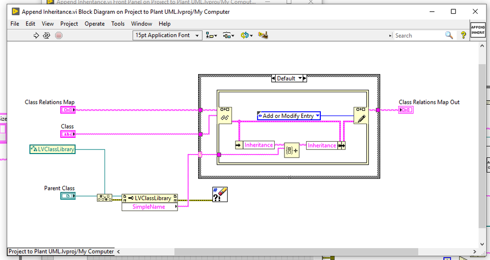
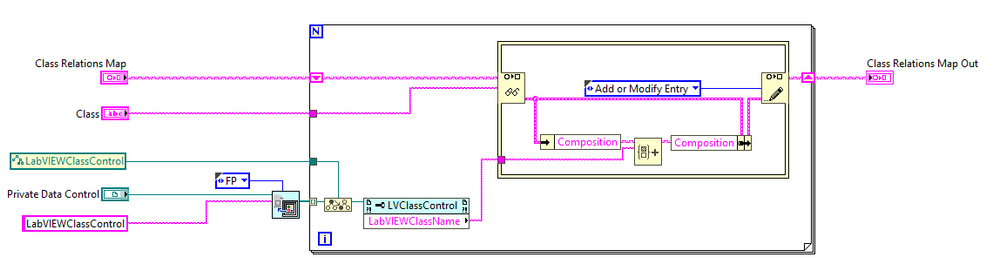
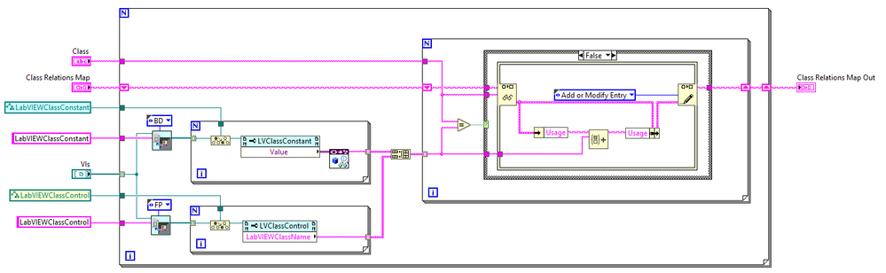
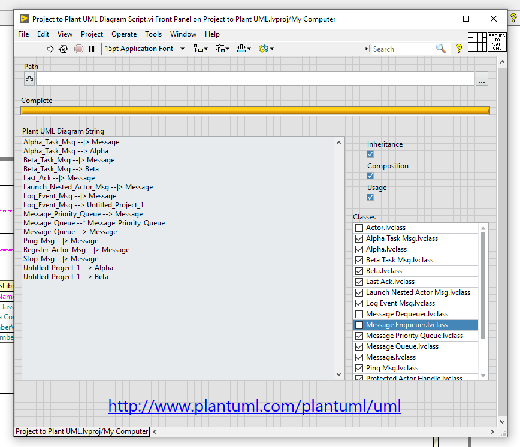
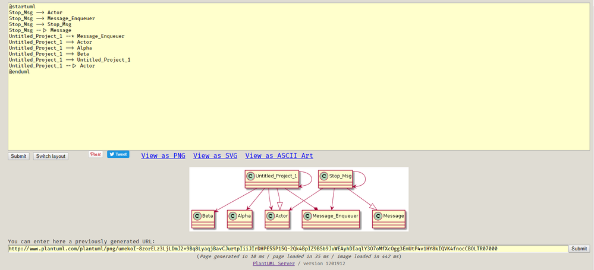

# LabVIEW Class Project Plant UML
Small tool to convert an existing LabVIEW OO project into a Plant UML class relationship description.

I needed to visualize my object oriented design. The Class Hierarchy in LabVIEW only shows inheritance relationship. I wrote a simple VI scripting tool which would show also usage and composition. It produces Plant UML string representation which can be used in an online tool http://www.plantuml.com/plantuml/uml to convert to a diagram. The created Plant UML representation can be a starting point for your documentation, you can edit the string to provide more info or use as is.

It is using LV19 because I needed sets and maps for class relationship representation. Cannot save to previous version, sorry.

